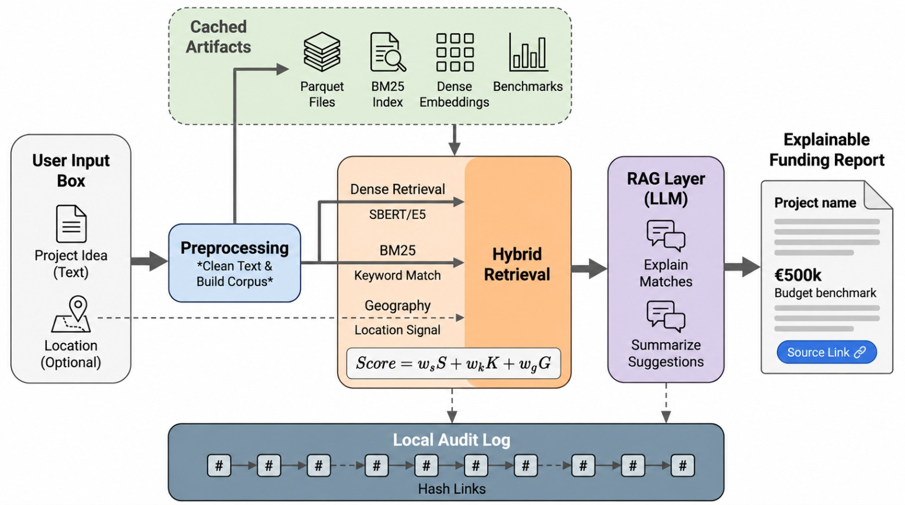

# Funding Compass

_Submission for the LUISS Artificial Intelligence Techniques course._

**Team members**

- Riccardo Palleschi
- Simone Prezioso
- Lapo Chiaselotti
- Silvia Monteleone

# 1. Introduction

Funding Compass is a proof of concept for early EU funding research: it helps to
reduce information gaps in European funding and makes AI outputs explainable,
traceable, and easier to review. A user enters a local project idea and, when useful,
a location. The system works as a search assistant for past EU projects. It compares the user's idea
with similar funded projects and returns the closest examples with their funding
context, budget benchmarks, source links, and short explanations.

The retrieval model selects the historical projects, then a local language model
explains why each selected project was matched. A local audit log records the input,
selected evidence, model configuration, suggestions, explanations, and hash links
between runs.

The data comes from Kohesio, the European Commission portal for EU cohesion policy
projects. The raw files in `data/raw` contain one CSV per country for the 2021-2027
period. The dataset contains 124,988 records and 26 country
codes. Each record includes project names, summaries, beneficiary information,
programme and fund labels, policy and specific objectives,
intervention categories, EU budget values, location fields, and source URLs [1].

The implementation is contained in `src/main.ipynb`. The notebook runs the pipeline
shown in Figure 1: schema validation, corpus creation, BM25 text preparation, dense
index construction, geocoding, hybrid retrieval, benchmarking, RAG explanations,
audit logging, and a complete user example.

# 2. Methods

## 2.1 Data collection and building the corpus

The notebook loads one CSV file per country from `data/raw`. Before it builds any
index, it checks that every file has the columns needed by the prototype: project
names and summaries for matching, geography fields for location scoring, funding
labels and budget fields for suggestions and benchmarks. After validation, the
corpus builder cleans text fields, standardizes labels and country codes, parses
budget values, extracts coordinates from location strings, and creates stable record
identifiers.

The corpus keeps ranking signals separate from output fields. Ranking uses project
names, summaries, country codes, coordinates, NUTS3 (regional) labels,
and LAU (local administrative area) labels. The
fields shown to the user are copied from retrieved projects: programme, fund,
category, policy and specific objectives, EU budget,
place labels, and source URL. This separation prevents the system from inventing
funding metadata. It can only suggest values that already appear in similar
historical records.

The pipeline builds two text views. The first is the readable `search_text`,
which keeps both English and original language names and summaries for dense retrieval, display, and RAG evidence.
The second view removes multilingual stop words [2] and tokenizes the same content for BM25.
In the notebook output, the readable text has an average length of 2,159.61 characters,
while the BM25 text has an average length of 1,635.17 characters.
This gives the sparse model a cleaner term representation,
while the original text remains available for display and explanations.



_Figure 1: Retrieval, explanation, and audit pipeline._

## 2.2 Retrieval models

The system searches a historical corpus and ranks
the closest examples to the user idea. Table 1 lists the
candidates used.

| Candidate                       | Role in the comparison                                                                                             |
| ------------------------------- | ------------------------------------------------------------------------------------------------------------------ |
| BM25 sparse retrieval           | Keyword baseline for exact terms, locations, sectors, policy labels, and domain words, implemented with BM25S [3]. |
| SBERT MPNet dense retrieval     | Semantic baseline using `sentence-transformers/all-mpnet-base-v2` [4].                                             |
| Multilingual E5 dense retrieval | Multilingual dense retrieval using `intfloat/multilingual-e5-large` [5].                                           |
| Hybrid retrieval                | Final ranking model, combining dense similarity, BM25 keyword evidence, and optional geography.                    |

_Table 1: Retrieval candidates compared._

The hybrid confidence score combines three normalized components:

```text
confidence =
  semantic_weight * semantic_score
  + keyword_weight * keyword_score
  + geographic_weight * geographic_score
```

If no usable location is available, the geography component is left out and the
remaining weights are renormalized. Geography can improve a match only when the user
provides a location and the retrieved records contain usable location data.

## 2.3 Benchmarking and tuning

The benchmark uses 200 historical project records sampled from the processed corpus.
Each sampled record becomes a query. The notebook removes label names from the query
text so the model cannot win by matching the answer directly. During evaluation, the
source record is also excluded from the retrieval corpus, so the model cannot receive
credit for returning the same project.

The tuning step uses the coefficient matrix reported in Table 2. For each dense
candidate in Table 1 and each semantic, keyword, and geography weight combination,
the notebook runs all 200 benchmark queries and then compares the average metrics.

| Configuration | Semantic | Keyword | Geography |
| ------------- | -------: | ------: | --------: |
| C1            |     0.70 |    0.20 |      0.10 |
| C2            |     0.60 |    0.30 |      0.10 |
| C3            |     0.60 |    0.25 |      0.15 |
| C4            |     0.50 |    0.35 |      0.15 |
| C5            |     0.50 |    0.30 |      0.20 |

_Table 2: Coefficient matrix tested for the hybrid confidence score._

Retrieved records are scored with the graded relevance rules in Table 3.

| Grade | Match condition                        | Interpretation |
| ----- | -------------------------------------- | -------------- |
| 3     | Same specific objective                | Strong match   |
| 2     | Same category or same policy objective | Partial match  |
| 1     | Same fund or programme only            | Weak match     |
| 0     | None of the selected labels match      | Not relevant   |

_Table 3: Relevance grades used for retrieval evaluation._

The benchmark uses Precision@10, Mean Reciprocal Rank, and NDCG@10. NDCG@10 is the
main metric because it rewards the model for placing stronger matches above weaker
ones. Precision@10 checks how many relevant records appear in the first ten results.
Mean Reciprocal Rank checks how quickly the first relevant record appears.

## 2.4 Explanation and traceability

Retrieval controls the ranking. The local LLM receives one selected project at a
time, together with the input idea, match metadata, and score components. Its job is
limited to explaining why that project was selected. It cannot change the rank,
confidence score, programme, fund, category, objective, budget, or location metadata.
The notebook uses `gemma4:e4b` through Ollama, with a strict JSON output contract
[7].

The prototype handles traceability through a local audit log that appends new records.
Each run writes a JSON block under `data/audit`. The block
stores hashes of the input, location metadata, LLM input, explanations, suggestions,
and retrieved project IDs. It also stores the previous and current block hashes. If
the input, result, or explanation changes later, the hash changes too. That keeps
each run repeatable and inspectable later.

# 3. Results and discussion

## 3.1 Corpus and label structure

The processed dataset contains 124,988 records and 26 country codes.
For the populated labels used in the benchmark, the notebook reports 7 fund values,
619 category labels, 65 specific objective labels, 10 policy objective labels, and
173 programmes. Table 4 explains why the retrieval evaluation gives more weight to
category and objective matches than to fund or policy matches.

| Field              | Unique values | Top value share | Interpretation                                      |
| ------------------ | ------------: | --------------: | --------------------------------------------------- |
| Specific objective |            65 |           18.8% | Strong signal, though still shared by many records. |
| Category           |           619 |           13.5% | Most detailed relevance signal used here.           |
| Policy objective   |            10 |           45.1% | Broad policy context.                               |
| Fund               |             7 |           50.1% | Funding context, weak on its own.                   |
| Programme          |           173 |           10.3% | Programme context and relevance support.            |

_Table 4: Label distribution for the relevance fields used in the benchmark._

## 3.2 Retrieval quality

Table 5 lists the top benchmark configurations from the current notebook output.
Multilingual E5 with weights 0.50 / 0.35 / 0.15 has the highest NDCG@10. Its
Precision@10 is also near the best value, while SBERT MPNet has a slightly higher
MRR in one configuration ranked lower by NDCG@10.

| Rank | Candidate       | Weights S/K/G      | Precision@10 |    MRR | NDCG@10 |
| ---: | --------------- | ------------------ | -----------: | -----: | ------: |
|    1 | multilingual E5 | 0.50 / 0.35 / 0.15 |       0.8225 | 0.9185 |  0.9408 |
|    2 | multilingual E5 | 0.60 / 0.30 / 0.10 |       0.8185 | 0.9166 |  0.9401 |
|    3 | multilingual E5 | 0.50 / 0.30 / 0.20 |       0.8220 | 0.9215 |  0.9395 |
|    4 | multilingual E5 | 0.60 / 0.25 / 0.15 |       0.8195 | 0.9189 |  0.9388 |
|    5 | SBERT MPNet     | 0.50 / 0.35 / 0.15 |       0.8210 | 0.9297 |  0.9373 |

_Table 5: Top retrieval configurations on the 200 query benchmark._

The selected setup therefore uses multilingual E5 as the dense component. It assigns
0.50 to semantic similarity, 0.35 to BM25 keyword evidence, and 0.15 to geography.
Meaning is the strongest signal, BM25 preserves exact public policy terms, and
geography adds a limited local adjustment.

These results are consistent with the corpus. Many records contain both English and
original programme language descriptions, so multilingual embeddings help. BM25 still matters
because project summaries contain exact sector terms, policy terms, and location
names that should not be lost inside a dense embedding. The geography score works
best as a small adjustment, not as the main ranking factor.

## 3.3 Example run

The final notebook example searches for projects similar to renovating public school
buildings in Italy with insulation, smart energy monitoring, and renewable heating
systems. The top ten results are all energy efficiency projects for public or school
buildings. They mention insulation, heating replacement, renewable energy, and energy
performance improvements. The top matches come from Romania, Poland, France, Czechia,
and Slovakia. All ten are funded by the European Regional Development Fund.

The confidence scores range from 0.7544 for the top match to 0.6842 for the tenth
match. The median eligible expenditure benchmark is about EUR 573,675. The
explanations focus on the shared public building energy efficiency theme and on
similar technical measures. Geography is not used in this example because the
retrieved top ten records are not Italian records, even though the input location is
Italy.

The notebook also includes an example about reusing a station near Trento. In that run, the top
result is the Italian ERDF project `S4T`, with confidence 0.998. The explanation
table records that the Rovereto location contributed to the match score. This check
shows that the geography branch is active when the query location and the retrieved
project location can be connected.

## 3.4 Business value and limitations

Funding Compass is useful at the early framing stage of a public project. A user can
start with a plain idea and quickly see comparable past projects, funding context,
budget benchmarks, source links, and short explanations. The prototype helps users
navigate a fragmented information space, explains why
records were selected, and keeps enough metadata to review the result later.

The explanation and audit layers also help reviewers: users can see why each result
was selected, which fields came from retrieved evidence, and whether geography
changed the score. The audit log keeps hashes of the input, evidence, explanations,
suggestions, and previous run, so the process remains traceable later.

The main limitation is the benchmark. Relevance labels are approximated from project
metadata. Sharing a category or objective is a reasonable signal, but it does not
replace a human judgment that two projects are truly similar. The benchmark evaluates
retrieval quality, not the legal or business correctness of a funding
recommendation. The local LLM also has a narrow role: it explains retrieved evidence,
but it does not validate call rules, legal eligibility, or future funding
availability.

The implementation also has limits. The audit layer is a local chained log, not a
smart contract deployment (which is required for a true blockchain).

# 4. Conclusions

Funding Compass shows that hybrid retrieval gives public sector users a practical
first view of similar projects funded by the EU. The best benchmark result uses multilingual
E5, BM25, and a limited geography adjustment, reaching NDCG@10 of 0.9408 on the
200 query benchmark. The architecture is easy to inspect: retrieval selects the
evidence, the local LLM explains that evidence, and the audit log records the run in
a linked sequence of hashes.

The next version should add human labelled relevance judgments, stronger multilingual tests,
and a user interface. It should also keep project similarity separate from funding
eligibility. Similarity can be estimated from historical records.
Eligibility must be checked against current calls, rules, budgets, and
administrative constraints before anyone makes a real funding decision.

# Bibliography

[1] Kohesio. European Commission EU cohesion policy project portal.
<https://kohesio.ec.europa.eu/en>.

[2] Stopwords ISO multilingual stop words list.
<https://github.com/stopwords-iso/stopwords-iso>.

[3] BM25S documentation. <https://bm25s.github.io/>.

[4] Sentence Transformers model card for `sentence-transformers/all-mpnet-base-v2`.
<https://huggingface.co/sentence-transformers/all-mpnet-base-v2>.

[5] Multilingual E5 model card for `intfloat/multilingual-e5-large`.
<https://huggingface.co/intfloat/multilingual-e5-large>.

[6] Nominatim geocoding documentation. <https://nominatim.org/>.

[7] Ollama local model reference for `gemma4:e4b`.
<https://ollama.com/library/gemma4:e4b>.

# Appendix A: Code Description

The implementation is contained in `src/main.ipynb`. Table 6 summarizes the
notebook pipeline.

| Notebook section   | Role                                                                                               |
| ------------------ | -------------------------------------------------------------------------------------------------- |
| Setup              | Loads libraries and defines paths, versions, `TOP_K`, and random seed.                             |
| Schema Validation  | Checks that all raw CSV files contain the required columns.                                        |
| Project Corpus     | Cleans fields, parses budgets and coordinates, and writes `data/processed/eu_projects_v1.parquet`. |
| BM25 Lexical Text  | Builds tokenized text for sparse retrieval.                                                        |
| BM25 Index         | Builds the BM25 index from `data/indexes`.                                                         |
| Dense Indexes      | Builds SBERT MPNet and multilingual E5 embeddings.                                                 |
| Geocoding          | Uses Nominatim [6] and country code shortcuts to produce location metadata and geography scores.   |
| Hybrid Model       | Combines semantic, keyword, and geography scores and returns ranked matches.                       |
| Benchmark Queries  | Builds the 200 query benchmark set.                                                                |
| Label Distribution | Checks whether relevance labels are broad or specific.                                             |
| Benchmark Results  | Evaluates candidates and weight combinations.                                                      |
| RAG                | Creates suggestions and match explanations with the local LLM.                                     |
| Audit Block        | Writes chained audit records.                                                                      |
| User Example       | Runs the full POC end to end.                                                                      |

_Table 6: High level notebook structure._

Pseudocode:

```text
load raw country CSV files
validate required schema
clean names, summaries, labels, budgets, and coordinates
build readable search text and BM25 token text
cache processed dataset and indexes
for a user query:
    clean text and geocode optional location
    compute dense, BM25, and optional geography scores
    combine scores into confidence
    retrieve top K historical projects
    copy programme, fund, objective, category, budget, and source fields
    ask local LLM to explain each selected match using only retrieved evidence
    write a chained audit block
return ranked table, explanations, suggestions, and audit metadata
```
